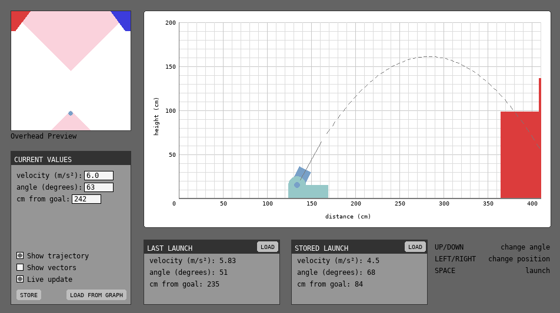

# decode-launchsim
A projectile motion simulator specifically for FTC DECODE 2024. 

## Troubleshooting

- Note that velocity is taken in meters per second but the distance from the goal is taken in centimeters. this is for better readability.

- You must click off of a textinput box if you would like to use the arrowkeys to adjust the distance/angle.

- if requirements are broken try:\
`pip install pygame`\
`pip install pygame-textinput`

 Thank you for visiting/downloading! ^_^
  If you have other issues I would be happy to revisit this code but as you can probably tell this was my first time using python and it's so comically bad I'm not sure I'll be able to fix it without bulldozing a lot of things. Still, any bug reports are appreciated.

